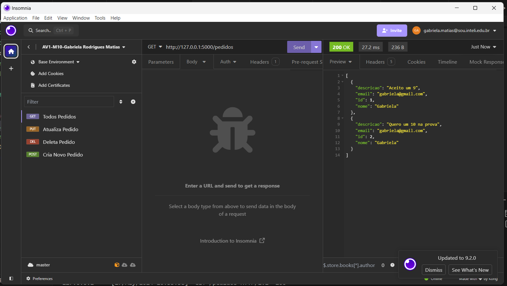
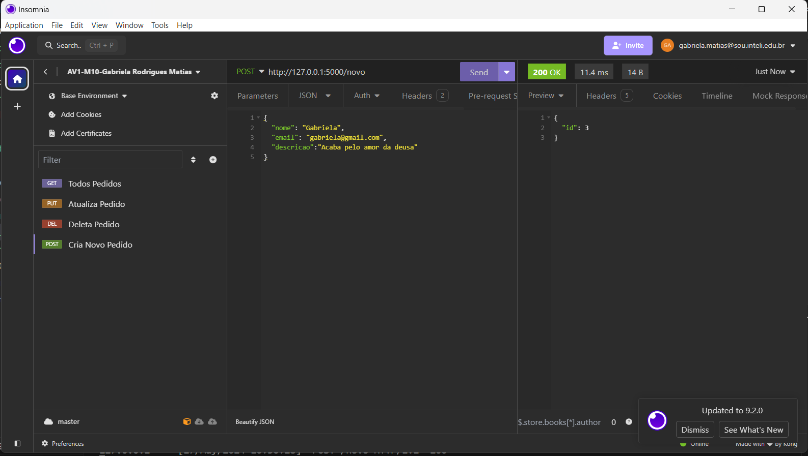
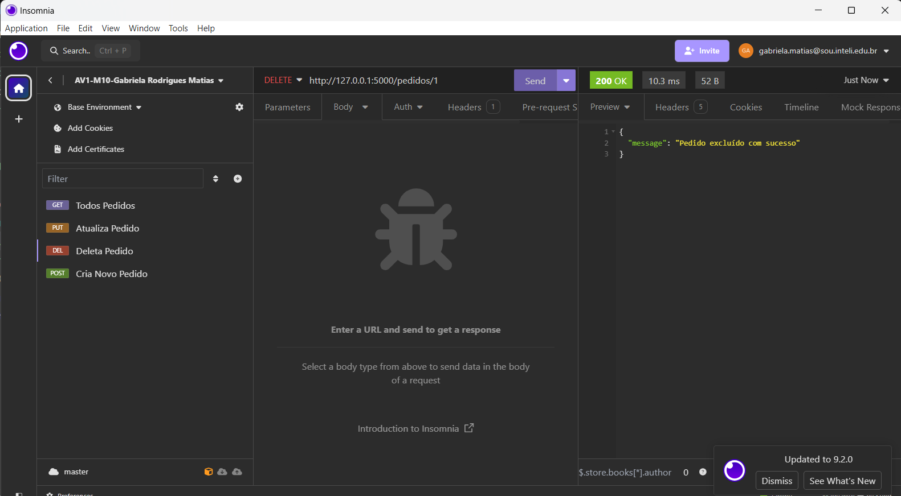
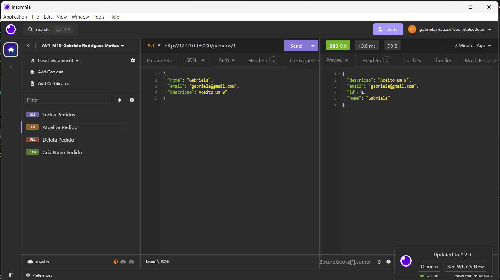

# Gabriela Rodrigues Matias
## Engenharia da Computação - Módulo 10

### Avaliação 1
________________________________________

## Critérios de Avaliação
O seu sistema deve fornecer, no mínimo, as seguintes rotas:

[x] - /novo: cadastrar um novo pedido. Recebe um JSON e retorna um ID.

[x] - /pedidos: retorna todos os pedidos cadastrados

[x] - /pedidos/<id>: retorna o pedido do ID fornecido. Se esse pedido não existir, retornar que não foi possível locallizar ele, da forma mais apropriada para atender as questões do problema proposto.

[x] - O recurso / pedidos/<id> ainda deve possibilitar editar o pedido e excluir ele, implementados em recursos distintos.

[x] - Nenhuma interface gráfica deve ser implementada, apenas as rotas. Elas devem ser testadas utilizando collections do Insomnia. Essas coleções devem ser exportadas no repositório.

[x] - A solução deve ser dockerizada.

___________________________________________________

## Estrutura do Projeto
1. main.py: Arquivo responsável por iniciar o servidor e o banco de dados
2. Insomnia - Collections de Teste da API 
3. requirements.txt - Dependências necessárias
4. docker-compose.yml - Arquivo docker responsável por rodar o serviço

## Executando o Projeto

### Executando com ambiente virtual (env) e Flask

1. Certifique-se de ter o Python instalado em sua máquina.

2. Crie um ambiente virtual para isolar as dependências do projeto. No terminal, execute o seguinte comando:

    ```bash
    python -m venv env
    ```

3. Ative o ambiente virtual. No Windows, execute o seguinte comando:

    ```bash
    env\Scripts\activate
    ```

    No macOS ou Linux, execute o seguinte comando:

    ```bash
    source env/bin/activate
    ```

4. Instale as dependências do projeto. No terminal, execute o seguinte comando:

    ```bash
    pip install -r requirements.txt
    ```

5. Inicie o servidor Flask. No terminal, execute o seguinte comando:

    ```bash
    python main.py
    ```

6. O servidor estará em execução e você poderá acessar as rotas definidas no seu navegador.

### Executando com Docker

1. Certifique-se de ter o Docker instalado em sua máquina.

2. No terminal, navegue até o diretório do projeto onde está localizado o arquivo `docker-compose.yml`.

3. Execute o seguinte comando para construir e iniciar os containers:

    ```bash
    docker-compose up
    ```

4. O servidor estará em execução dentro do container Docker e você poderá acessar as rotas definidas no seu navegador.


## Collections
Todas as APIs desenvolvidas foram testadas no projeto, por meio do Insomnia, conforme demonstrado abaixo:

### API - Get


### API - Post


### API - Delete


### API - Update


